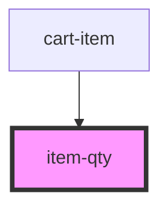

# item-qty

<!-- Auto Generated Below -->

## Properties

| Property   | Attribute  | Description | Type      | Default     |
| ---------- | ---------- | ----------- | --------- | ----------- |
| `qty`      | `qty`      |             | `number`  | `undefined` |
| `readonly` | `readonly` |             | `boolean` | `undefined` |

## Dependencies

### Used by

 - [cart-item](..)

### Graph

----------------------------------------------

*Built with [StencilJS](https://stenciljs.com/)*
