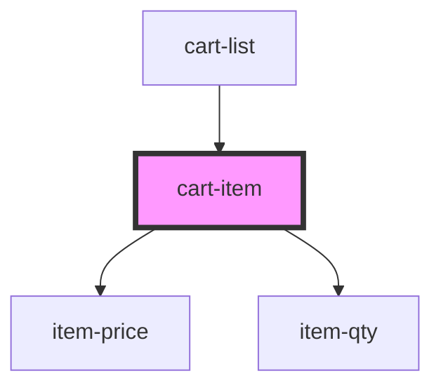

# cart-item

<!-- Auto Generated Below -->

## Properties

| Property    | Attribute   | Description | Type     | Default     |
| ----------- | ----------- | ----------- | -------- | ----------- |
| `name`      | `name`      |             | `string` | `undefined` |
| `price`     | `price`     |             | `number` | `undefined` |
| `qty`       | `qty`       |             | `number` | `undefined` |
| `size`      | `size`      |             | `string` | `undefined` |
| `skuId`     | `sku-id`    |             | `string` | `undefined` |
| `thumbnail` | `thumbnail` |             | `string` | `undefined` |

## Dependencies

### Used by

 - [cart-list](../cart-list)

### Depends on

- [item-price](item-price)
- [item-qty](item-qty)

### Graph

----------------------------------------------

*Built with [StencilJS](https://stenciljs.com/)*
